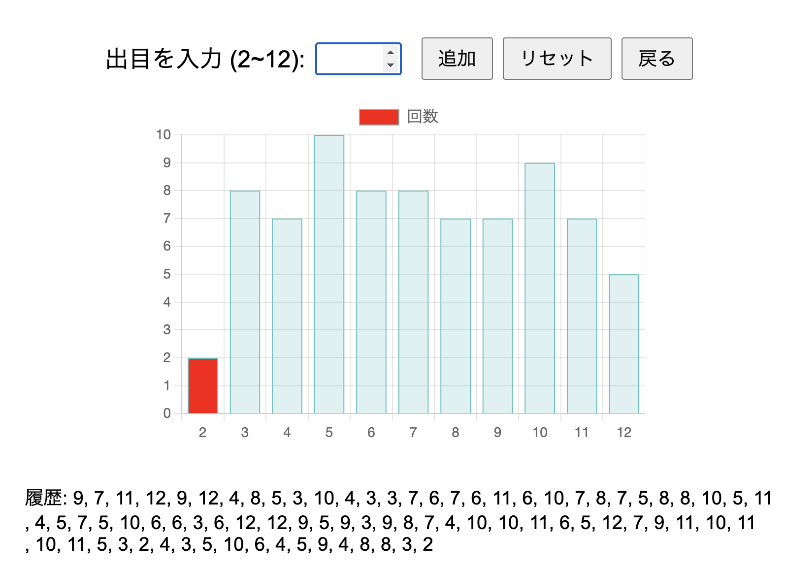

# カタンの出目グラフ
https://sbmtrntr.github.io/catan/ で使うことができます。

## 概要
カタンの出目グラフを作成するツールです。
サイコロは実際に振ってください。

## 使い方
1. 出目を入力してください。
2. 出目を入力したら、グラフが表示されます。(直前の数字は赤く表示されます)
3. グラフを見て、カタンが統計学に従わない運ゲーであることを確認してください。
4. 最後に、JSON形式で結果をダウンロードできます。
